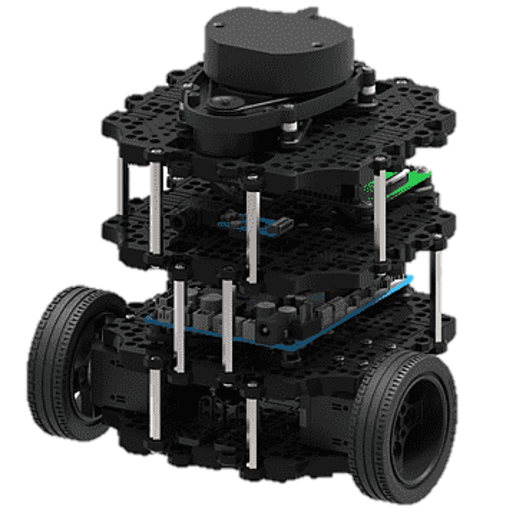
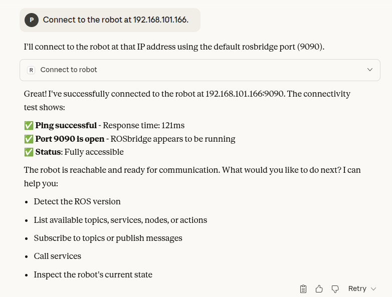
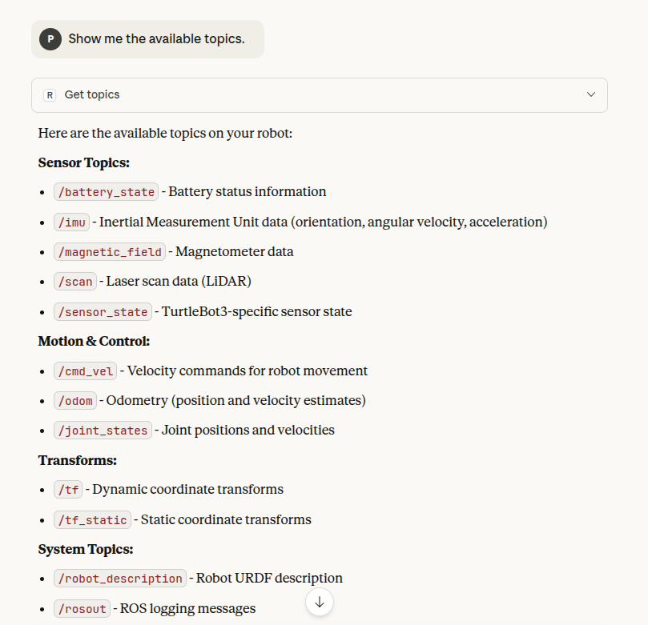
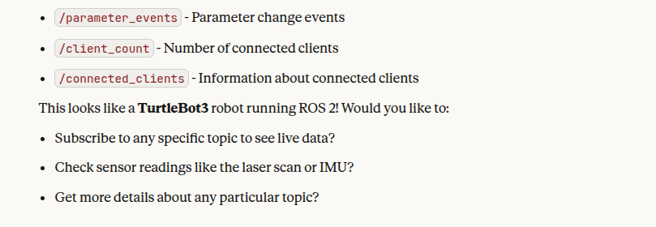
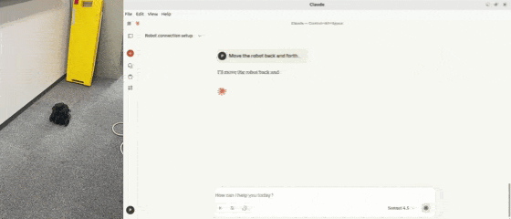

# Example - Turtlebot3 (Real)


This example demonstrates the use of a real TurtleBot3 Burger robot with ROS2.
The TurtleBot3 is a compact, customizable mobile robot designed for education and research. It supports applications such as SLAM, navigation, and autonomous control, and comes in various hardware configurations.


## Prerequisites

For this example, the TurtleBot3 Burger version with Ubuntu 22.04 and ROS2 Humble is used. Depending on your TurtleBot3 model and installed hardware (e.g., LDS-01 LiDAR), make sure to install the corresponding packages required for your specific configuration.

### Turtlebot3

For more details, please refer to the [TurtleBot3 Documentation](https://emanual.robotis.com/docs/en/platform/turtlebot3/overview/).



- **Specification**
    - **OS** : Ubuntu 22.04
    - **ROS** : ROS2 Humble
    - **TurtleBot3 Model** : Burger
    - **LiDAR** : LDS-01
    - **Computer** : Raspberry Pi 3 Model B+ (1GB RAM)
    - **Motor Controller** : OpenCR 1.0 (Firmware v0.2.1)

## Quick Start

### 1. Network Setup

Since the TurtleBot3 is controlled via ROS-MCP from the user PC, it is important to connect both the user PC and the TurtleBot3 to the same network.
> **Note:** You can check your network IP address with the `ifconfig` command.

**Ping Test**

After connecting them to the same network, perform a ping test from the user PC to TurtleBot3 to verify that the connection is established correctly:  
**[User's PC]**
```bash
ping <TURTLEBOT3_IP>   # e.g., ping 192.168.101.166
```

**ROS2 Network Setup**

In ROS2, environment variables are used to configure Domain ID and ROS middleware behavior.
On both the user PC and TurtleBot3, export:  
**[User's PC]** **[Turtlebot3 SBC]**
```bash
echo "export ROS_DOMAIN_ID=30" >> ~/.bashrc
echo "export RMW_IMPLEMENTATION=rmw_fastrtps_cpp" >> ~/.bashrc
source ~/.bashrc
```

### 2. Bringup Turtlebot3

Open a new terminal on the user PC and connect to the Raspberry Pi via SSH using its IP address. Enter your Ubuntu OS password for the Raspberry Pi.

**[User's PC]**
```bash
ssh ubuntu@{IP_ADDRESS_OF_RASPBERRY_PI}
```

Bring up basic packages to start essential TurtleBot3 applications. You will need to specify your TurtleBot3 model.

**[Turtlebot3 SBC]**
```bash
export TURTLEBOT3_MODEL=burger
ros2 launch turtlebot3_bringup robot.launch.py
```

### 3. Launch Node on Your Turtlebot3 SBC and Open claude-desktop on Your PC

**[Turtlebot3 SBC]**
```bash
ros2 launch rosbridge_server rosbridge_websocket_launch.xml  
```

**[User's PC]**
```bash
claude-desktop
```

## **Example Walkthrough**
You're now ready to interact with the TurtleBot3 via the ROS MCP server. Follow these examples step-by-step:

### **Example 1**: Connect to Robot



### **Example 2**: Check Available Topics




### **Example 3**: Move the Robot Back and Forth



## **Next Steps**
If your TurtleBot3 is equipped with a Raspberry Pi camera, you can now start streaming visual data. Try integrating camera feeds into your pipeline for more advanced robot control demos.